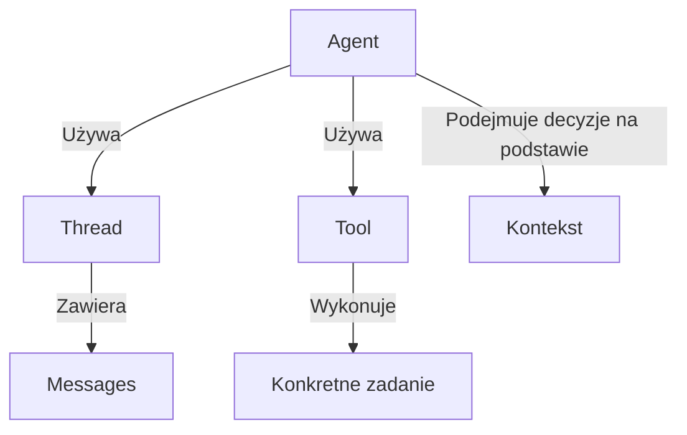
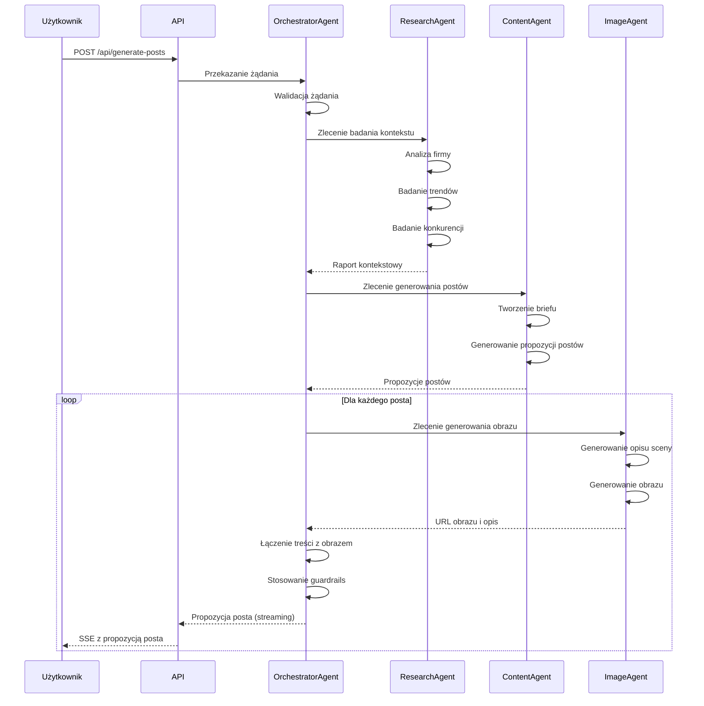
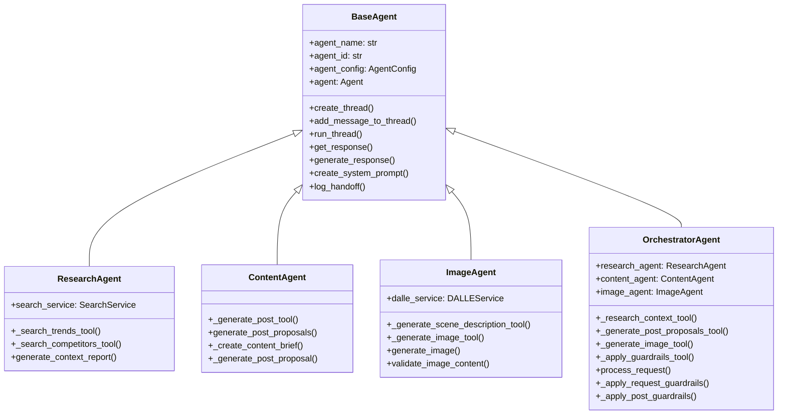
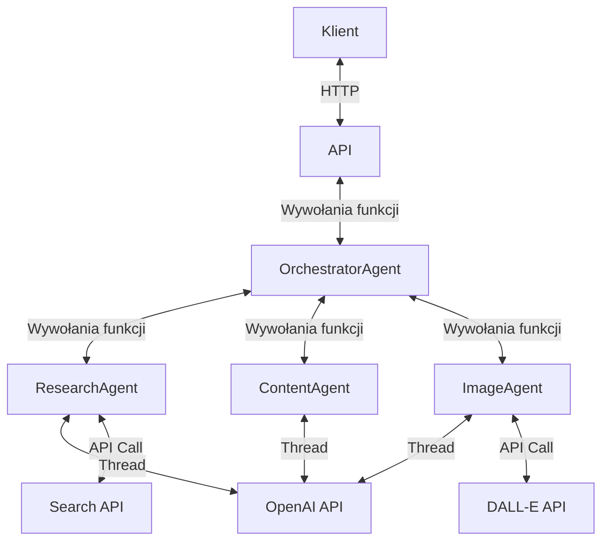
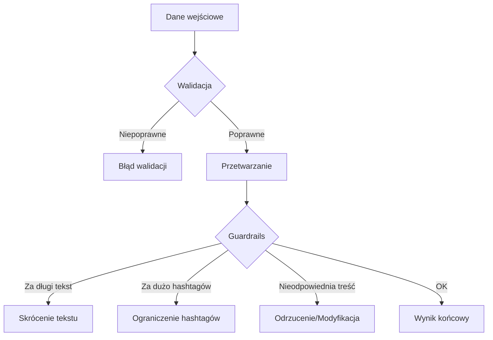
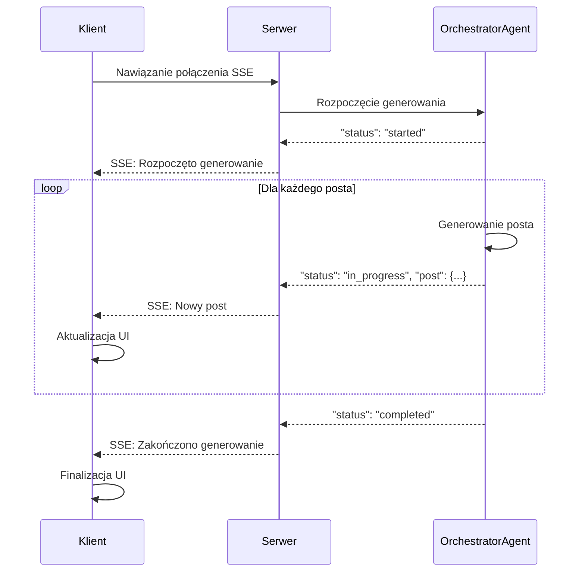

# Szczegółowy opis działania aplikacji Facebook Post Generator z OpenAI Agents

## 1. Ogólny zarys aplikacji

Nasza aplikacja to generator postów na Facebooka, który wykorzystuje sztuczną inteligencję (OpenAI) do tworzenia propozycji postów dla firm. Aplikacja analizuje informacje o firmie, aktualne trendy i działania konkurencji, a następnie generuje posty, które są zgodne z charakterem marki i jej "Brand Hero" (postacią reprezentującą markę).

## 2. Struktura projektu - folder po folderze

Projekt ma następującą strukturę:

```
/app                      - Główny folder aplikacji
  /agents                 - Agenci AI odpowiedzialni za różne zadania
  /api                    - Definicje API i modeli danych
  /services               - Usługi do komunikacji z zewnętrznymi API
  /utils                  - Narzędzia pomocnicze
/tests                    - Testy aplikacji
  /mock_data              - Przykładowe dane do testów
  /test_agents            - Testy agentów
  /test_api               - Testy API
  /test_e2e               - Testy end-to-end
```

## 3. Jak działa Agent SDK?

OpenAI Agent SDK to biblioteka, która pozwala tworzyć "agentów" - specjalne programy AI, które mogą wykonywać konkretne zadania. W naszej aplikacji:

1. **Agent** to inteligentny asystent, który może:
   - Prowadzić rozmowę (przez "wątki" - threads)
   - Używać narzędzi (tools) do wykonywania zadań
   - Podejmować decyzje na podstawie kontekstu

2. **Thread** (wątek) to ciąg wiadomości między użytkownikiem a agentem

3. **Tool** (narzędzie) to funkcja, którą agent może wywołać, np. wyszukiwanie informacji



## 4. Przepływ danych w aplikacji - krok po kroku

Gdy użytkownik chce wygenerować posty, dzieje się następująca sekwencja:



### Krok 1: Użytkownik wysyła żądanie
Użytkownik wysyła żądanie HTTP POST na endpoint `/api/generate-posts` z danymi:
- Informacje o firmie (nazwa, opis, wartości, grupa docelowa)
- Informacje o Brand Hero (postaci reprezentującej markę)
- Liczba propozycji postów do wygenerowania
- Czy uwzględnić trendy i konkurencję

### Krok 2: API odbiera żądanie
Plik `app/api/routes.py` odbiera żądanie i przekazuje je do OrchestratorAgent.

### Krok 3: OrchestratorAgent koordynuje pracę
`OrchestratorAgent` (w pliku `app/agents/orchestrator.py`) działa jak dyrygent orkiestry:
1. Sprawdza poprawność żądania (guardrails)
2. Deleguje zadania do wyspecjalizowanych agentów
3. Zbiera wyniki i zwraca je użytkownikowi

### Krok 4: ResearchAgent zbiera informacje
`ResearchAgent` (w pliku `app/agents/research.py`):
1. Analizuje kontekst firmy
2. Jeśli potrzeba, wyszukuje aktualne trendy w branży
3. Jeśli potrzeba, analizuje działania konkurencji
4. Tworzy raport kontekstowy

### Krok 5: ContentAgent generuje treść postów
`ContentAgent` (w pliku `app/agents/content.py`):
1. Otrzymuje raport kontekstowy i informacje o Brand Hero
2. Tworzy brief zawartości (content brief)
3. Generuje propozycje postów zgodne z briefem i osobowością Brand Hero
4. Każdy post zawiera tekst, hashtagi i opcjonalne wezwanie do działania

### Krok 6: ImageAgent tworzy obrazy
`ImageAgent` (w pliku `app/agents/image.py`):
1. Dla każdego posta generuje opis sceny z Brand Hero
2. Używa DALL-E do wygenerowania obrazu pasującego do posta
3. Zwraca URL obrazu i jego opis

### Krok 7: OrchestratorAgent łączy wszystko
1. Łączy treść posta z obrazem
2. Stosuje guardrails (np. ogranicza długość tekstu, liczbę hashtagów)
3. Zwraca kompletne propozycje postów

### Krok 8: API zwraca wyniki
API zwraca strumień wyników w formacie Server-Sent Events (SSE), dzięki czemu użytkownik widzi posty na bieżąco, jak są generowane.

## 5. Jak działają agenci - szczegółowo



### BaseAgent (app/agents/base.py)
To podstawowa klasa, z której dziedziczą wszyscy agenci. Zawiera:
- Inicjalizację konfiguracji agenta
- Metody do tworzenia wątków i dodawania wiadomości
- Metody do uruchamiania wątków i pobierania odpowiedzi
- Funkcję do generowania odpowiedzi na podstawie promptów

```python
# Przykład inicjalizacji agenta
self.agent_config = AgentConfig(
    name=agent_name,
    description=f"A {agent_name} that helps with generating Facebook posts",
    model=settings.openai_model,
    tools=[],  # Będzie nadpisane przez podklasy
    instructions=self._get_default_instructions(),
)
```

### ResearchAgent (app/agents/research.py)
Ten agent ma narzędzia do:
- Wyszukiwania trendów w branży
- Wyszukiwania informacji o konkurencji

```python
# Przykład narzędzia do wyszukiwania trendów
FunctionTool(
    function=self._search_trends_tool,
    config=ToolConfig(
        name="search_trends",
        description="Search for current trends in a specific industry",
        input_schema={
            "type": "object",
            "properties": {
                "industry": {
                    "type": "string",
                    "description": "The industry to search trends for"
                },
                "keywords": {
                    "type": "array",
                    "items": {"type": "string"},
                    "description": "Keywords to include in the search"
                }
            },
            "required": ["industry", "keywords"]
        }
    )
)
```

### ContentAgent (app/agents/content.py)
Ten agent ma narzędzia do:
- Generowania treści postów na podstawie briefu i Brand Hero

### ImageAgent (app/agents/image.py)
Ten agent ma narzędzia do:
- Generowania opisu sceny dla obrazu
- Generowania obrazu na podstawie opisu sceny

### OrchestratorAgent (app/agents/orchestrator.py)
Ten agent ma narzędzia do:
- Badania kontekstu
- Generowania propozycji postów
- Generowania obrazów
- Stosowania guardrails

## 6. Jak działa komunikacja między komponentami



1. **HTTP Request/Response**: Komunikacja między klientem a API
2. **Wywołania funkcji**: Komunikacja między OrchestratorAgent a wyspecjalizowanymi agentami
3. **Threads (wątki)**: Komunikacja między agentem a modelem AI
4. **Tools (narzędzia)**: Sposób, w jaki agent wykonuje konkretne zadania

## 7. Guardrails - zabezpieczenia

Aplikacja zawiera wiele zabezpieczeń:
- Walidacja danych wejściowych
- Ograniczenia długości tekstu postów
- Ograniczenia liczby hashtagów
- Zapewnienie zgodności z wartościami marki
- Unikanie nieodpowiednich treści



## 8. Jak uruchomić aplikację

1. Zainstaluj zależności: `pip install -r requirements.txt`
2. Utwórz plik `.env` na podstawie `.env.example` i dodaj swój klucz API OpenAI
3. Uruchom aplikację: `uvicorn app.main:app --reload`
4. Aplikacja będzie dostępna pod adresem http://localhost:8000

## 9. Jak wysłać żądanie do API

Możesz wysłać żądanie HTTP POST na endpoint `/api/generate-posts` z danymi w formacie JSON:

```json
{
  "company_context": {
    "name": "EcoTech Solutions",
    "description": "Firma zajmująca się rozwiązaniami ekologicznymi dla biznesu i domu",
    "values": ["zrównoważony rozwój", "innowacyjność", "odpowiedzialność społeczna"],
    "target_audience": ["świadomi ekologicznie konsumenci", "małe i średnie firmy", "instytucje publiczne"],
    "tone_of_voice": "profesjonalny, ale przystępny, inspirujący do działania",
    "industry": "technologie ekologiczne",
    "additional_info": {
      "flagship_products": ["EcoHome Smart System", "BusinessGreen Solutions", "EcoAudit"],
      "recent_achievements": ["Nagroda Eco Innovation 2024", "Redukcja śladu węglowego o 30% w ostatnim roku"]
    }
  },
  "brand_hero": {
    "name": "Eko Ekspert",
    "appearance": "Postać w wieku 30-35 lat, ubrana w nowoczesny, ale ekologiczny strój w odcieniach zieleni i błękitu. Ma krótkie, zadbane włosy i przyjazny uśmiech. Często pokazywana w otoczeniu natury lub z gadżetami ekologicznymi.",
    "personality": "Entuzjastyczny, pomocny, kompetentny. Łączy wiedzę eksperta z przystępnym podejściem.",
    "backstory": "Były naukowiec, który postanowił wykorzystać swoją wiedzę do promowania ekologicznych rozwiązań w codziennym życiu.",
    "values": ["edukacja", "praktyczne rozwiązania", "pozytywny wpływ"],
    "tone_of_voice": "Przyjazny, entuzjastyczny, ale merytoryczny. Używa prostego języka do wyjaśniania złożonych koncepcji."
  },
  "num_proposals": 10,
  "include_trends": true,
  "include_competitors": true
}
```

## 10. Jak działa streaming wyników



Aplikacja używa Server-Sent Events (SSE) do strumieniowania wyników:
1. Klient nawiązuje połączenie z endpointem
2. Serwer wysyła wydarzenia w miarę generowania postów
3. Klient odbiera wydarzenia i aktualizuje interfejs użytkownika

To pozwala użytkownikowi widzieć posty na bieżąco, zamiast czekać na wszystkie naraz.

## Podsumowanie

Aplikacja wykorzystuje zaawansowane możliwości OpenAI Agent SDK do tworzenia inteligentnego systemu, który:
1. Analizuje kontekst firmy
2. Bada trendy i konkurencję
3. Generuje treść postów zgodną z osobowością Brand Hero
4. Tworzy obrazy pasujące do postów
5. Zwraca kompletne propozycje postów

Wszystko to dzieje się w sposób strumieniowy, dzięki czemu użytkownik widzi wyniki na bieżąco.
